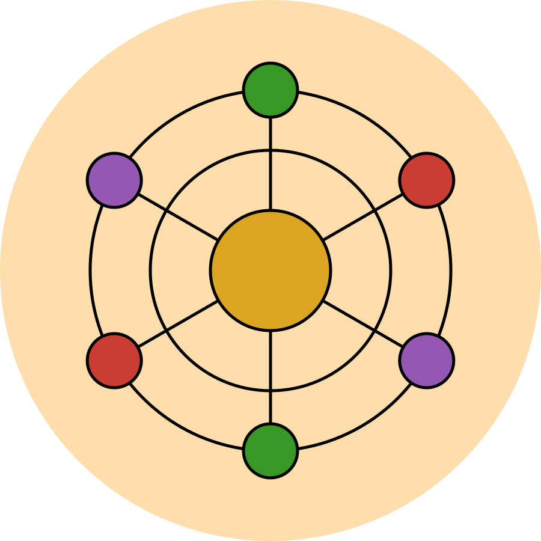
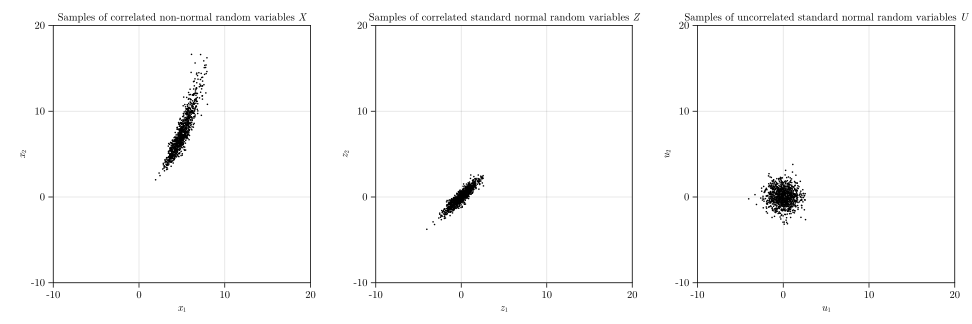

# Fortuna

<div align="center">
  

  | Build Status | Latest Release |
  | :---: | :---: |
  | [](https://github.com/AkchurinDA/Fortuna.jl/actions/workflows/CI.yml) | [](https://juliahub.com/ui/Packages/Fortuna/fEeSh) |
</div>

## Description
`Fortuna` is a general purpose Julia package for structural reliability analysis.

## Installation
To install `Fortuna` package, type `]` in Julia REPL to enter package manager mode and execute the following command:

```
pkg> add Fortuna
```

## Quick Start
To start using `Fortuna` package, type the following command in Julia REPL or in the beginning of a file:

```julia
using Fortuna
```

### Generating Random Variables
`Fortuna` package builds its capacity to generate random variables using `generaterv()` function by utilizing the widely-adopted [Distributions](https://github.com/JuliaStats/Distributions.jl) package, enabling seamless integration with other Julia packages such as [Turing](https://github.com/TuringLang/Turing.jl). However, unlike [Distributions](https://github.com/JuliaStats/Distributions.jl) package, Fortuna allows you to generate random variables not only using their **parameters**, but also using their **moments**, which often useful.

```julia
# Generate a lognormally distributed random variable R with mean (μ) of 15 and standard deviation (σ) of 2.5:
R = generaterv("Lognormal", "Moments", [15, 2.5])

# Generate a gamma-distributed random variable Q with shape parameter (α) of 16 and scale parameter (θ) of 0.625:
Q = generaterv("Gamma", "Parameters", [16, 0.625])
```

### Performing Nataf Transformation
`Fortuna` package allows to easily perform the Nataf transformation of correlated random variables into the space of uncorrelated standard normal variables.

```julia
# Define a random vector:
X₁ = generaterv("Gamma", "Moments", [10, 1.5])
X₂ = generaterv("Gumbel", "Moments", [15, 2.5])
X = [X₁, X₂]

# Define correlation coefficients between marginal random variables of the random vector:
ρˣ = [1 0.75; 0.75 1]

# Perform Nataf transformation of the random vector by defining a "NatafTransformation" object:
NatafObject = NatafTransformation(X, ρˣ)
```

The results of the performed Nataf transformation can be accesses from the fields of the defined `NatafTransformation` object.

```julia
# Extract the distorted correlation matrix of correlated normal random variables:
display(NatafObject.ρᶻ)
# 2×2 Matrix{Float64}:
#  1.0       0.765315
#  0.765315  1.0

# Extract the lower triangular matrix of the Cholesky decomposition of the distorted correlation matrix:
display(NatafObject.L)
# 2×2 LinearAlgebra.LowerTriangular{Float64, Matrix{Float64}}:
#  1.0        ⋅ 
#  0.765315  0.643656

# Extract the inverse of the lower triangular matrix of the Cholesky decomposition of the distorted correlation matrix
display(NatafObject.L⁻¹)
# 2×2 LinearAlgebra.LowerTriangular{Float64, Matrix{Float64}}:
#   1.0       ⋅ 
#  -1.18901  1.55362
```

### Sampling Random Variables
`Fortuna` package also allows to easily generate samples of uncorrelated and correlated random variables using `samplerv()` function using different sampling techniques. Current version of the package implements [Inverse Transform Sampling (ITS)](https://en.wikipedia.org/wiki/Inverse_transform_sampling) and [Latin Hypercube Sampling (LHS)](https://en.wikipedia.org/wiki/Latin_hypercube_sampling) techniques.

#### Uncorrelated Random Variables
The function `generaterv()` allows to generate samples of a single distribution, as well as to generate samples of random vectors.
```julia
# Define a random vector:
X₁ = generaterv("Gamma", "Moments", [10, 1.5])
X₂ = generaterv("Gumbel", "Moments", [15, 2.5])
X = [X₁, X₂]

# Generate 3 samples of the random variable X₁ using Inverse Transform Sampling:
X₁SamplesITS = samplerv(X₁, 3, ITS())
# 3-element Vector{Float64}:
#  8.438113227625095
#  9.103174415760643
#  11.11171748034975

# Generate 3 samples of the random variable X₁ using Latin Hypercube Sampling:
X₁SamplesLHS = samplerv(X₁, 3, LHS())
# 3-element Vector{Float64}:
#  10.70297332783710
#  9.380731608864231
#  8.997067439248992

# Generate 3 samples of the random vector using Inverse Transform Sampling:
XSamplesITS = samplerv(X, 3, ITS())
# 3×2 Matrix{Float64}:
#  11.1815  11.6162
#  11.0042  12.6362
#  10.4576  13.8437

# Generate 3 samples of the random vector using Latin Hypercube Sampling:
XSamplesLHS = samplerv(X, 3, LHS())
# 3×2 Matrix{Float64}:
#  9.14107  12.6207
#  9.64263  13.5258
#  8.63828  19.3058
```

#### Correlated Random Variables
Generating the correlated random variables can be done by:
1. Performing the Nataf transformation of the random correlated variables.

```julia
# Define a random vector:
X₁ = generaterv("Gamma", "Moments", [5, 1])
X₂ = generaterv("Gumbel", "Moments", [7.5, 2.5])
X = [X₁, X₂]

# Define correlation coefficients between marginal distributions of the random vector:
ρˣ = [1 0.90; 0.90 1]

# Perform Nataf transformation by defining a "NatafTransformation" object:
NatafObject = NatafTransformation(X, ρˣ)
```

2. Generating samples in X-, Z-, and U-spaces of the random vector with correlated marginal random variables by passing the defined `NatafTransformation` object directly into the sampling function `samplerv()`.

```julia
# Generate samples of the random vector in X-, Z-, and U-spaces:
XSamples, ZSample, USamples = samplerv(NatafObject, 5*10^3)
```
<div align = center>
  
</div>

### Reliability Analysis 
Ultimately, `Fortuna` package is developed to perform structural reliability analysis. The current version of the package implements Mean-Centered First-Order Second-Moment (MCFOSM), Hasofer-Lind Rackwitz-Fiessler (HLRF), and improved Hasofer-Lind Rackwitz-Fiessler (iHLRF) methods that fall within a broader class of First-Order Reliability Methods (FORM). `Fortuna` package also implements Curve-Fitting method that fall within a broader class of Second-Order Reliability Methods (SORM) for a more precise estimation of probabilities of failure.

#### First-Order Reliability Methods (FORM)

##### Mean-Centered First-Order Second-Moment (MCFOSM) Reliability Method
The MCFOSM method is the simplest and least expensive type of reliability method. It utilizes the first-order Taylor expansion of the limit state function at the mean values and the first two moments of the random variables involved in the reliability problem to evaluate the reliability index. However, despite the fact that it is simple and does not require the complete knowledge of the random variables involved in the reliability problem, the MCFOSM method faces an issue known as the invariance problem. This problem arises because the resulting reliability index is dependent on the formulation of the limit state function. In other words, two equivalent limit state functions with the same failure boundaries produce two different reliability indices; thus, the use of MCFOSM method is not recommended.

```julia
# Define a random vector of correlated marginal distributions:
X₁ = generaterv("Normal", "Moments", [10, 2])
X₂ = generaterv("Normal", "Moments", [20, 5])
X = [X₁, X₂]
ρˣ = [1 0.5; 0.5 1]

# Define two equivalent limit state functions to demonstrate the invariance problem of the MCFOSM method:
G₁(x::Vector) = x[1]^2 - 2 * x[2]
G₂(x::Vector) = 1 - 2 * x[2] / x[1]^2

# Define reliability problems:
Problem₁ = ReliabilityProblem(X, ρˣ, G₁)
Problem₂ = ReliabilityProblem(X, ρˣ, G₂)

# Perform the reliability analysis using MCFOSM:
Solution₁ = analyze(Problem₁, FORM(MCFOSM()))
Solution₂ = analyze(Problem₂, FORM(MCFOSM()))
println("MCFOSM:")
println("β from G₁: $(Solution₁.β)")
println("β from G₂: $(Solution₂.β)")
# MCFOSM:
# β from G₁: 1.664100588675687
# β from G₂: 4.285714285714286
```

##### Hasofer-Lind Rackwitz-Fiessler (HLRF) Reliability Method
The HLRF method overcomes the invariance problem faced by the MCFOSM method by using the first-order Taylor expansion of the limit state function at a point known as the "design point" on the failure boundary. Since the design point is not known a priori, the HLRF method is inherently an iterative method. `Fortuna` implements two versions of HLRF method: plain HLRF method where the step size in the negative gradient descent is set to unity and improved HLRF (iHLRF) method where the step size is determined using a merit function. 

```julia
Solution₁ = analyze(Problem₁, FORM(iHLRF()))
Solution₂ = analyze(Problem₂, FORM(iHLRF()))
println("FORM:")
println("β from G₁: $(Solution₁.β)")
println("β from G₂: $(Solution₂.β)")
# FORM:
# β from G₁: 2.10833940741697
# β from G₂: 2.10833972384163
```

#### Second-Order Reliability Methods (SORM)

##### Curve-Fitting (CF) method

The SORM is an improvement over the FORM by accounting for the curved nature of the failure boundary around the design point; thus, providing a better approximation of the probability of failure. The current version of `Fortuna` implements the Curve-Fitting (CF) method that fits a hyper-paraboloid surface with a vertex at the design point and the principal curvatures matching the principal curvatures of the failure boundary at that point. The probabilities of failure are estimated using Hohenbichler-Rackwitz (1988) and Breitung (1984) approximations of the exact solution provided by Tvedt (1990). The calculated probabilities of failure are then used to estimate the generalized reliability indices that account curved nature of the failure boundary around the design point.

```julia
# Define a random vector of correlated marginal distributions:
M₁ = generaterv("Normal", "Moments", [250, 250 * 0.3])
M₂ = generaterv("Normal", "Moments", [125, 125 * 0.3])
P = generaterv("Gumbel", "Moments", [2500, 2500 * 0.2])
Y = generaterv("Weibull", "Moments", [40000, 40000 * 0.1])
X = [M₁, M₂, P, Y]
ρˣ = [1 0.5 0.3 0; 0.5 1 0.3 0; 0.3 0.3 1 0; 0 0 0 1]

# Define a limit state function:
a = 0.190
s₁ = 0.030
s₂ = 0.015
G(x::Vector) = 1 - x[1] / (s₁ * x[4]) - x[2] / (s₂ * x[4]) - (x[3] / (a * x[4]))^2

# Define a reliability problem:
Problem = ReliabilityProblem(X, ρˣ, G)

# Perform the reliability analysis using curve-fitting SORM:
Solution = analyze(Problem, SORM(CF()))
println("SORM:")
println("β from FORM: $(Solution.β₁)")
println("β from SORM: $(Solution.β₂[1]) (Hohenbichler and Rackwitz)")
println("β from SORM: $(Solution.β₂[2]) (Breitung)")
println("PoF from FORM: $(Solution.PoF₁)")
println("PoF from SORM: $(Solution.PoF₂[1]) (Hohenbichler and Rackwitz)")
println("PoF from SORM: $(Solution.PoF₂[2]) (Breitung)")
# SORM:
# β from FORM: 2.4660212074327954
# β from SORM: 2.34102664328639 (Hohenbichler and Rackwitz)
# β from SORM: 2.3595536288265766 (Breitung)
# PoF from FORM: 0.006831162247281989
# PoF from SORM: 0.009615397347018759 (Hohenbichler and Rackwitz)
# PoF from SORM: 0.009148468011924852 (Breitung)
```

## Roadmap

The following functionality is planned to be added:
- [x] Transformations
  - [x] Nataf Transformation
  - [ ] Rosennblatt Transformation
- [x] Sampling Techniques
  - [x] Inverse Transform Sampling
  - [x] Latin Hypercube Sampling
- [ ] Reliability Methods
  - [ ] First-Order Reliability Method (FORM)
    - [x] Mean-Centered First-Order Second-Moment (MCFOSM) Method
    - [ ] Hasofer-Lind (HL) Method?
    - [ ] Rackwitz-Fiessler (RF) Method?
    - [x] Hasofer-Lind Rackwitz-Fiessler (HLRF) Method
    - [x] Improved Hasofer-Lind Rackwitz-Fiessler (iHLRF) Method
  - [ ] Second-Order Reliability Method (SORM)
    - [x] Curve-Fitting (CF) Method
    - [ ] Gradient-Free (GF) Method?
    - [ ] Point-Fitting (PF) Method?
- [ ] Sensitivity Analysis

## License

`Fortuna` package is distributed under the [MIT license](https://en.wikipedia.org/wiki/MIT_License). More information can be found in the `LICENSE` file.

## Help and Support

For assistance with the package, please raise an issue on the Github Issues page. Please use the appropriate labels to indicate the specific functionality you are inquiring about. Alternatively, contact the author directly.

## Acknowledgements

The author thanks academic and industrial partners of the "Reliability 2030" project for their financial support. The author also thanks Dr. Armen Der Kiureghian for his book "Structural and System Reliability" (2022) that was a major inspiration for the development of this package.