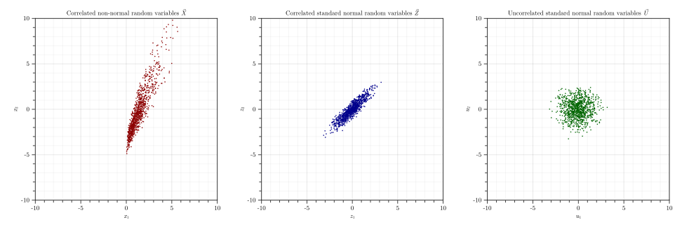

# Sampling Random Variables

`Fortuna.jl` package allows to easily generate samples of both uncorrelated and correlated random variables using `samplerv()` function using different sampling techniques. Current version of the package implements [Inverse Transform Sampling (ITS)](https://en.wikipedia.org/wiki/Inverse_transform_sampling) and [Latin Hypercube Sampling (LHS)](https://en.wikipedia.org/wiki/Latin_hypercube_sampling) techniques.

```@setup 1
using Fortuna
using Random
Random.seed!(1)
```

## Sampling Random Vectors with Uncorrelated Marginal Random Variables 

```@example 1
# Generate a random vector X with uncorrelated marginal random variables X₁ and X₂:
X₁ = generaterv("Gamma", "M", [10, 1.5])
X₂ = generaterv("Gumbel", "M", [15, 2.5])
X = [X₁, X₂]

nothing # hide
```

```@example 1
# Generate 3 samples of the random vector X using Inverse Transform Sampling technique:
XSamplesITS = samplerv(X, 3, ITS())
```

```@example 1
# Generate 3 samples of the random vector X using Latin Hypercube Sampling technique:
XSamplesLHS = samplerv(X, 3, LHS())
```

```@docs
samplerv(Samplers::Union{<:Distribution,Vector{<:Distribution}}, NumSamples::Integer, SamplingTechnique::AbstractSamplingTechnique)
```

## Sampling Random Vectors with Correlated Marginal Random Variables

```@example 1
# Generate a random vector X with correlated marginal random variables X₁ and X₂:
X₁ = generaterv("Gamma", "M", [10, 1.5])
X₂ = generaterv("Gumbel", "M", [15, 2.5])
X = [X₁, X₂]

# Define the correlation matrix:
ρˣ = [1 0.90; 0.90 1]

# Perform the Nataf Transformation by defining a "NatafTransformation" object:
NatafObject = NatafTransformation(X, ρˣ)

# Generate 1000 samples of the random vector X in X-, Z-, and U-spaces:
XSamples, USamples, ZSamples = samplerv(NatafObject, 1000)

nothing # hide
```



```@docs
samplerv(Object::NatafTransformation, NumSamples::Integer)
```